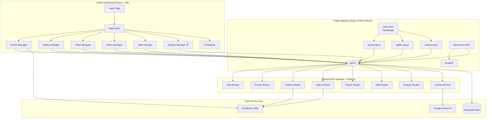
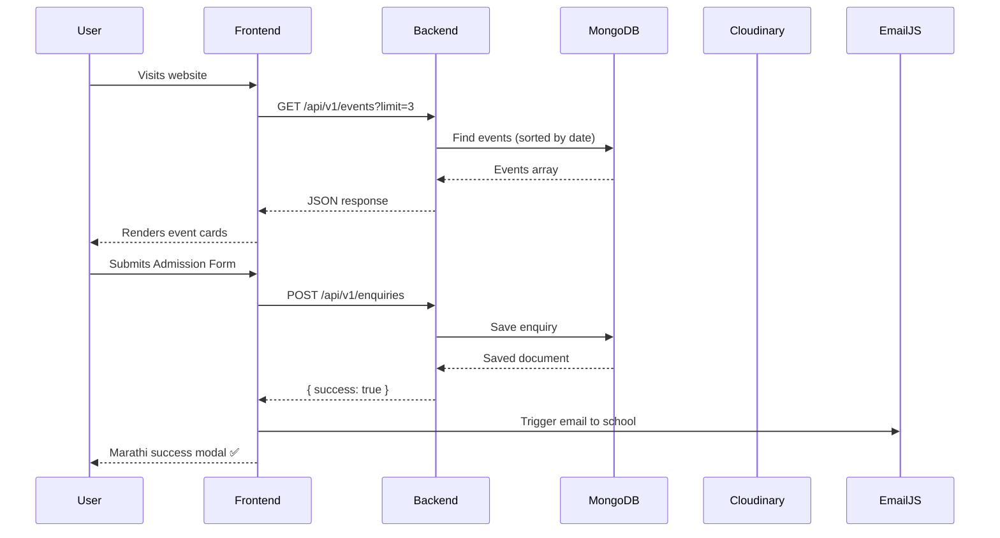

# Dnyansiddhi Adarsh Gurukul Academy (DAGA)
### 🏫 School Management Website — Full Stack Web Application

> A complete, production-ready school management platform built for Dnyansiddhi Adarsh Gurukul Academy, Ashta. Features a public-facing website, admin dashboard, REST API backend, dynamic content management, and an admissions enquiry system.

[](https://nodejs.org/)
[](https://expressjs.com/)
[](https://mongodb.com/)
[](https://react.dev/)
[](https://vitejs.dev/)
[](https://cloudinary.com/)

---

## 📋 Table of Contents

- [Overview](#-overview)
- [Architecture](#-architecture)
- [Features](#-features)
- [Project Structure](#-project-structure)
- [Tech Stack](#-tech-stack)
- [Getting Started](#-getting-started)
- [Environment Variables](#-environment-variables)
- [API Reference](#-api-reference)
- [Admin Dashboard](#-admin-dashboard)
- [Deployment](#-deployment)

---

## 🌟 Overview

DAGA is a school in Ashta, Maharashtra, established in 2019. This platform provides:
- A **public website** with Marathi content, events, gallery, and information pages
- An **Admin Dashboard** (React + Ant Design) for managing all content
- A **REST API backend** (Node.js + Express + MongoDB) with authentication
- An **Admissions Enquiry System** — form submissions saved to the DB and emailed via EmailJS
- **Dynamic content** — events, gallery, videos, notices, staff — all loaded from the API

---

## 🏗 Architecture



---

## 🌊 Request Flow



---

## 🎯 Admissions Enquiry Flow

```mermaid
flowchart LR
    A[Student fills form] --> B{Backend API}
    B --> C[(MongoDB\nEnquiry saved)]
    B --> D[EmailJS triggers\nEmail to school]
    C --> E[Admin Dashboard\nShows new enquiry]
    E --> F{Admin action}
    F -->|Update| G[नवीन → पाहिले]
    G --> H[पाहिले → संपर्क झाला]
    D --> I[dnyansiddhigurukul\n@gmail.com]
```

---

## ✨ Features

| Feature | Details |
|---|---|
| 🌐 Public Website | Marathi content, dark mode, animations, SEO |
| 📅 Events | Dynamic events from API, featured toggle, date badge |
| 🖼️ Photo Gallery | Cloudinary CDN, category filter, lightbox |
| 🎬 Video Gallery | YouTube embeds, filter by category |
| 📢 Notices | Announcement bar + toast notifications |
| 👥 Staff Section | Dynamic staff cards, 2-column mobile layout |
| 📋 Admissions | Form → DB + EmailJS notification |
| 🔒 Admin Dashboard | JWT auth, full CRUD for all content |
| 🤖 AI Chat | Google Gemini AI powered school assistant |
| 🌙 Dark Mode | System-aware dark/light mode toggle |
| 📱 Responsive | Mobile-first, works on all devices |
| 🛡️ Security | Rate limiting, Helmet.js, CORS, validation |

---

## 📁 Project Structure

```
DAGA/
├── 📄 index.html              # Homepage
├── 📄 admissions.html         # Apply Now form
├── 📄 event.html              # Events listing
├── 📄 staff.html              # Staff page
├── 📄 photo_gallary.html      # Photo gallery
├── 📄 video_gallary.html      # Video gallery
├── 📄 about_us.html           # About page
├── 📄 contact_us.html         # Contact page
│
├── 📂 styles/                 # CSS files
│   ├── main.css               # Global design tokens
│   ├── dark-mode.css          # Dark mode overrides
│   ├── news.css               # Event card styles
│   ├── staff.css              # Staff grid styles
│   └── ...
│
├── 📂 js/                     # Frontend JavaScript
│   ├── events-api.js          # Dynamic event loading
│   ├── gallery-api.js         # Dynamic gallery loading
│   ├── notices-api.js         # Dynamic notices loading
│   ├── shared-header.js       # Injected navigation
│   └── ...
│
├── 📂 images/                 # Static images
├── 📂 favicon/                # Favicon assets
│
└── 📂 packages/
    ├── 📂 backend/            # Node.js + Express API
    │   ├── server.js          # Express app entry
    │   ├── config/
    │   │   ├── db.js          # MongoDB connection
    │   │   └── cors.js        # CORS configuration
    │   ├── models/
    │   │   ├── Event.js
    │   │   ├── Gallery.js
    │   │   ├── Video.js
    │   │   ├── Notice.js
    │   │   ├── Staff.js
    │   │   ├── Enquiry.js     # Admissions enquiries
    │   │   └── Admin.js
    │   ├── routes/
    │   │   ├── events.js
    │   │   ├── gallery.js
    │   │   ├── videos.js
    │   │   ├── notices.js
    │   │   ├── staff.js
    │   │   ├── enquiries.js   # Admissions form API
    │   │   ├── auth.js
    │   │   └── chat.js
    │   ├── middleware/
    │   │   ├── auth.js        # JWT verification
    │   │   ├── rateLimiter.js # Rate limiting
    │   │   └── errorHandler.js
    │   └── seed/
    │       └── seed-admin.js  # Create first admin user
    │
    └── 📂 admin/              # React + Vite Admin Dashboard
        └── src/
            ├── pages/
            │   ├── Dashboard.jsx
            │   ├── EventManager.jsx
            │   ├── GalleryManager.jsx
            │   ├── VideoManager.jsx
            │   ├── NoticeManager.jsx
            │   ├── StaffManager.jsx
            │   ├── EnquiryManager.jsx  # Admissions enquiries
            │   └── AISettings.jsx
            ├── context/
            │   ├── AuthContext.jsx
            │   └── ThemeContext.jsx
            └── components/
                └── Layout/AppLayout.jsx
```

---

## 🛠 Tech Stack

### Frontend (Public Website)
- **HTML5 + CSS3** — semantic markup, CSS variables, animations
- **Vanilla JavaScript** — no framework, fast load times
- **Google Fonts** — Inter + Baloo 2 (Marathi/Devanagari support)
- **EmailJS** — client-side email for admissions form

### Admin Dashboard
- **React 18** + **Vite 5**
- **Ant Design (antd)** — UI component library
- **React Router v6** — navigation
- **Axios** — API calls with interceptors
- **Day.js** — date formatting

### Backend API
- **Node.js 18** + **Express 4**
- **MongoDB** + **Mongoose** — database & ODM
- **JWT** — authentication
- **Cloudinary** — image/video CDN storage
- **Multer** — file upload middleware
- **Helmet.js** — security headers
- **express-rate-limit** — spam protection
- **express-validator** — input validation
- **Google Gemini AI** — AI chat assistant

---

## 🚀 Getting Started

### Prerequisites
- Node.js ≥ 18
- MongoDB Atlas account (or local MongoDB)
- Cloudinary account
- EmailJS account (for admissions email notifications)

### 1. Clone the repository
```bash
git clone https://github.com/your-username/daga-school-website.git
cd daga-school-website
```

### 2. Set up the Backend
```bash
cd packages/backend
npm install
cp .env.example .env
# Fill in your .env values (see Environment Variables)
npm run seed    # Creates the first admin user
npm run dev     # Start development server on :3001
```

### 3. Set up the Admin Dashboard
```bash
cd packages/admin
npm install
npm run dev     # Start Vite dev server on :5173
```

### 4. Open the Website
Open `index.html` in a browser or use a Live Server extension (VS Code).

> The website fetches data from `http://localhost:3001` by default.

---

## 🔑 Environment Variables

Copy `packages/backend/.env.example` to `packages/backend/.env` and fill in:

```env
# Server
PORT=3001
NODE_ENV=development

# MongoDB
MONGODB_URI=mongodb+srv://<user>:<password>@cluster.mongodb.net/daga

# JWT
JWT_SECRET=your_very_long_random_secret_key_here
JWT_EXPIRE=7d

# Cloudinary (image storage)
CLOUDINARY_CLOUD_NAME=your_cloud_name
CLOUDINARY_API_KEY=your_api_key
CLOUDINARY_API_SECRET=your_api_secret

# Google Gemini AI (for AI chat)
GEMINI_API_KEY=your_gemini_api_key

# Admin seed (used by npm run seed)
SEED_ADMIN_USERNAME=admin
SEED_ADMIN_PASSWORD=your_secure_password
```

> ⚠️ **Never commit `.env` to GitHub.** It is already listed in `.gitignore`.

---

## 📡 API Reference

All API routes are prefixed with `/api/v1/`

| Method | Route | Auth | Description |
|---|---|---|---|
| `GET` | `/events` | ❌ | List events (`?featured=true&limit=3`) |
| `POST` | `/events` | ✅ | Create event (with image upload) |
| `PUT` | `/events/:id` | ✅ | Update event |
| `DELETE` | `/events/:id` | ✅ | Delete event |
| `GET` | `/gallery` | ❌ | List gallery items |
| `POST` | `/gallery` | ✅ | Upload gallery image |
| `GET` | `/videos` | ❌ | List videos |
| `GET` | `/notices` | ❌ | List notices |
| `GET` | `/staff` | ❌ | List staff |
| `POST` | `/enquiries` | ❌ | Submit admission enquiry |
| `GET` | `/enquiries` | ✅ | List all enquiries |
| `PATCH` | `/enquiries/:id/status` | ✅ | Update enquiry status |
| `DELETE` | `/enquiries/:id` | ✅ | Delete enquiry |
| `POST` | `/auth/login` | ❌ | Admin login |
| `POST` | `/chat` | ❌ | AI chat message |

---

## 🖥 Admin Dashboard

Access at `http://localhost:5173` after starting the admin dev server.

**Default credentials** (set via `npm run seed`):
- Username: `admin`
- Password: whatever you set in `SEED_ADMIN_PASSWORD`

### Dashboard Pages
| Page | Description |
|---|---|
| Dashboard | Stats overview (events, gallery, notices count) |
| Events | Create/edit/delete events with image upload |
| Gallery | Upload and manage photo gallery |
| Videos | Manage YouTube video links |
| Notices | Create school announcements |
| Staff | Manage staff cards and photos |
| Enquiries 📋 | View admission form submissions with status tracking |
| AI Settings | Configure the school AI chatbot |

---

## ☁️ Deployment

### Backend (Render / Railway / Heroku)
1. Set all environment variables in the hosting dashboard
2. Set build command: `npm install`
3. Set start command: `npm start`
4. Update `API_BASE` in all frontend JS files to your deployed URL

### Admin Dashboard (Vercel / Netlify)
1. Build: `npm run build` in `packages/admin`
2. Publish directory: `packages/admin/dist`
3. Set `VITE_API_URL` env var to your backend URL

### Frontend Website (GitHub Pages / Netlify)
- Deploy the root folder (all `.html` files + `styles/`, `js/`, `images/`)
- Update `API_BASE` in JS files before deployment

---

## 📧 EmailJS Setup (Admissions Form)

1. Sign up at [emailjs.com](https://emailjs.com) (free tier is sufficient)
2. Connect your Gmail account → note the **Service ID**
3. Create an Email Template with variables: `{{from_name}}`, `{{phone}}`, `{{reply_to}}`, `{{previous_school}}`, `{{standard}}`, `{{message}}`
4. Copy your **Public Key**, **Service ID**, **Template ID**
5. Update these 3 lines in `admissions.html`:
```js
const EMAILJS_PUBLIC_KEY  = 'your_key_here';
const EMAILJS_SERVICE_ID  = 'your_service_id';
const EMAILJS_TEMPLATE_ID = 'your_template_id';
```

---

## 🙏 Credits

Developed with ❤️ for **Dnyansiddhi Adarsh Gurukul Academy**, Ashta, Maharashtra, India — empowering students since 2019.